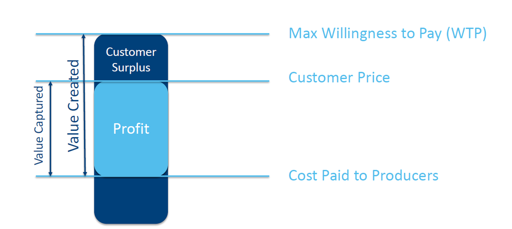

```{r setup, include=FALSE}
knitr::opts_chunk$set(echo = TRUE)
```

## What is Entrepreneurship? 
Longtime Harvard Business School Professor Howard Stevenson, who jumpstarted the study of entrepreneurship in the 1980s, defined entrepreneurship as: "[The] pursuit of opportunity beyond resources currently controlled." Simply establishing a new enterprise is not enough. Succesful entrepreneurship requires ***value creation*** -- some group of customers must be made better off by the product, service, or platform you are building. Then, the most direct test of whether customers are made better off is whether they are willing to pay a positive price (ideally more than your costs!). This is what economist call **willingness to pay (WTP)**. If customers WTP > costs of production, then you have created positive value. 

Successful entrepreneurship also involves ***value capture*** -- the ability to realize personal value (financial and otherwise) from establishing and operating a new venture. Value capture is usually measured in terms of profitability -- receiving revenues from customers in excess of the total costs of serving those customers. Capturing value means that businesses must create value in a way that cannot easily (or quickly) be imitated (or improved upon) by potential competitors. And because value capture is **necessary** for the company to survive in the long term (otherwise the firm will go bankrupt and all value is destroyed!), the economic return to a venture is more than simply its level of sales. 

```{r console, fig.cap="Value creation and capture",fig.align='center',out.width="50%",echo=FALSE}

```

As you probably already have noticed, while this sounds good in theory, the difficult part is putting the theory into practice. How do you create value? For whom are you creating value? Do your potential customers really value what you offer? How will you transfer value created to your customer? How will you capture value? What are your costs? Which price should you ask? These are all questions an entrepreneur needs to answer in order to build a successful business. 

The traditional way of approaching these questions was to treat startups and new ventures as small copies of large businesses. Entrepreneurs would write long business plans with detailed explanations of the product, market research, and financial forecasts. The problem is: this is a recipe for failure. This is because of two main reasons: 

1. ***Uncertainty*** -- Unlike established businesses, startups do not have a proven track record to rely on. This basically means that everything is an **assumption**. Startups do not yet know who their customer is or what their product should be. As the world becomes more uncertain it becomes harder and harder to predict the future. Planning and forecasting are only accurate when based on a long, stable operating history and a relatively static environment. Startups have neither. This means that only one of your assumptions needs to be false to make the whole plan break down. That is an enormous risk. As Steve Blank uses to say: "No one besides venture capitalists and the late Soviet Union requires five-year plans to forecast complete unknowns. These plans are generally fiction, and dreaming them up is almost always a waste of time." Furthermore, business plans rarely survive first contact with customers. As the boxer Mike Tyson once said about his opponents’ prefight strategies: “Everybody has a plan until they get punched in the mouth.”

1. ***Limited resources*** -- Faced with this extreme uncertainty, some entrepreneurs and investors have adopted a "Just Do It" approach. If traditional methods of planning fail, chaos is the answer. This doesn't work either, for the simple reason that most startups only have limited resources (financially and non-financially). Just going with a process of undirected trial-and-error will most likely lead you to run out of resources before finding an answer to the above questions.. 

## Aim 
This assignment is all about finding an answer to the questions of how to create and capture value under conditions of extreme uncertainty and limited resources. In particular, the aim of the assignment is: 

> Develop a sustainable and scalable business model centered around a discipline-related innovation through a process of validated learning

Let's break this down:

* **Business Model** -- A business model describes the rationale of how an organization creates, delivers, and captures value. It is an integrated array of distinctive choices specifying a new venture’s unique customer value proposition and how it will configure activities – including those of its partners – to deliver that value and earn sustainable profits. Think of a business model as a drawing that shows all the flows between the different parts of your company.  A business model diagram also shows how the product gets distributed to your customers and how money flows back into your company. The good thing about business models is that they show the underlying assumptions: Who are the customers/users? What’s the distribution channel. How do we price and position the product? How do we create end user demand? Who are our partners? Where/how do we build the product? How do we finance the company, etc. A large part of the assignment will revolve around translating these assumptions into ***testable hypotheses*** to verify whether they are true or false. 

* **Sustainable** -- This means different things. First, we focus on business models that do not need to rely on external financing injections eternally *by design*. E.g., offering medicine for free to inhabitants of low-income neighborhoods is a noble task but not a sustainable business model as you capture zero value and can only survive by relying on subsidies. Second, sustainable means that we are not interested in business models that revolve around [*rent-seeking*](https://en.wikipedia.org/wiki/Rent-seeking); merely capturing uncompensated value from others without making any contribution to productivity.

* **Scalable** --  Entrepreneurship often describes a small business whose owner starts up a company -- i.e. a plumbing supply store, a restaurant, a consulting firm. Many small businesses are the backbone of most developing and developed economies. But small businesses startups have very different objectives than scalable startups. A “scalable startup” takes an innovative idea and searches for a scalable and repeatable business model that will turn it into a high growth, profitable company. It does that by entering a large market and taking share away from incumbents or by creating a new market and growing it rapidly. 

* **Discipline-related innovation** -- Research teaches us that entrepreneurs working on a product that is related to their personal experience have an advantage. This is because they have a much better picture of the benefits and challenges of the technology, as well as of the industry landscape. Furthermore, experience is typically necessary to know how to build your product. For example, a physicist is much better equipped than a software programmer to see opportunities in the landscape of laser technology. We want you to exploit this advantage.

* **Validated learning** -- Startups exist not just to make stuff, make money, or even serve customers. The exist to *learn* how to build a sustainable business. This learning can be validated scientifically by running frequent experiments that allow entrepreneurs to test each element of their vision. In particular, a major part of this assignment will require you to "get out of the building" and test your hypotheses with (potential) customers. 


So, essentially:

> A startup is a temporary organization designed to search for a sustainable and scalable business model

## Further Readings and Background Material
* [Entrepreneurship: A Working Definition (Tom Eisenmann)](https://hbr.org/2013/01/what-is-entrepreneurship)
* [No Business Plan Survives First Contact With Customers. 2 Minutes to See Why (Steve Blank)](https://www.youtube.com/watch?v=_eUoae9lHpY&list=PLda67x2O472eZ2kicfuZrliRc7QPd_kJB&index=40)
* [What we know about startups (Steve Blank)](https://www.youtube.com/watch?v=GAzYdTUjDgQ&list=PLda67x2O472eZ2kicfuZrliRc7QPd_kJB&index=44)
