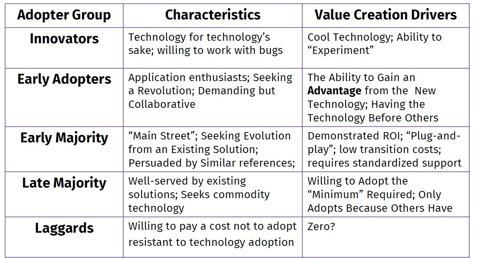

Now that you know your team and have your working space set up, it's time to get started! The first step of the assignment will focus on testing and validating whether you have a problem worth solving.

> Key question: Do I have a problem worth solving?

The first stage is about determining whether you have a problem worth solving before investing a lot of effort into building a solution. While ideas are cheap, acting on them is quite expensive.

A problem worth solving boils down to three questions:

* Is it something customers want? (must-have)
* Will they pay for it? If not, who will? (viable)
* Can it be solved? (feasible)

During this stage, we attempt to answer these questions using a combination of qualitative customer observation and interviewing techniques. From there you derive the minimum feature set to address the right set of problems, which is also known as the minimum viable product (MVP).

## Preparation
* [The Lean Product Playbook - Chapter 3: Determine Your Target Customer (Step 1)](https://github.com/jmahieu/Lean-Project/raw/main/The%20Lean%20Product%20Playbook%20-%202015%20-%20Olsen.pdf)
* [Running Lean - Chapter 3: Create Your Lean Canvas ](https://github.com/jmahieu/Lean-Project/raw/main/Ash%20Maurya%20-%20Running%20Lean%20(2nd%20edition).pdf)
* [The Mom Test - Chapter One](https://github.com/jmahieu/Lean-Project/raw/main/The%20Mom%20Test%20-%20Rob%20Fitzpatrick.pdf)
* [The Mom Test - Chapter Two](https://github.com/jmahieu/Lean-Project/raw/main/The%20Mom%20Test%20-%20Rob%20Fitzpatrick.pdf)
* [Running Lean - Chapter 6: Get Ready to Interview Customers ](https://github.com/jmahieu/Lean-Project/raw/main/Ash%20Maurya%20-%20Running%20Lean%20(2nd%20edition).pdf)
* [Running Lean - Chapter 7: The Problem Interview ](https://github.com/jmahieu/Lean-Project/raw/main/Ash%20Maurya%20-%20Running%20Lean%20(2nd%20edition).pdf)

## A. Brainstorm Possible Customers 
*Individually*, brainstorm about the list of possible target customers based on your initial idea. When thinking about potential initial customers, you want to focus on "innovators" and "early adopters" (see [The Lean Product Playbook - Chapter 3: Determine Your Target Customer (Step 1)](https://github.com/jmahieu/Lean-Project/raw/main/The%20Lean%20Product%20Playbook%20-%202015%20-%20Olsen.pdf) )

```{r console, fig.cap="Customer segments",fig.align='center',out.width="70%",echo=FALSE}

```

### Personas 
For each customer type, develop a customer persona. See pages 30-32 of [The Lean Product Playbook](https://github.com/jmahieu/Lean-Project/raw/main/The%20Lean%20Product%20Playbook%20-%202015%20-%20Olsen.pdf) on how to create customer personas.  It is okay at this point that you cannot complete all the information. 


Afterwards, sit together with your team and compare the customer personas you came up with. ***Select 1 or maximum 2 customer personas that you believe are most promising*** . The most promising customers are those that likely want a solution to their problems/needs, will pay for it, and have a solvable problem.

### **Deliverables** 

* Create a document in your workspace with the title "Customer Personas" with the information about your chosen customer personas(s)


## B. Document Your Plan A

After creating and choosing your preferred customer persona(s), each team member *individually* draws a Lean Canvas based on your chosen customer personas. Follow the steps in [Running Lean - Chapter 3: Create Your Lean Canvas ](https://github.com/jmahieu/Lean-Project/raw/main/Ash%20Maurya%20-%20Running%20Lean%20(2nd%20edition).pdf). It is okay to leave some spaces blank. This should take no longer than 15 minutes. 

You can use this [editable version of the Lean Canvas](https://github.com/jmahieu/Lean-Project/blob/main/lean-canvas.ppt?raw=true) in Powerpoint format

Afterwards, compare all the canvases, and pick the one you like most as a team. 

### **Deliverables** 

* Create a document in your workspace with the title "Plan A" with the sketch of your first lean canvas

## C. Conduct Problem Interviews
After you have created your first lean canvas it is time to start conducting your first interviews. 

The Problem interview is all about validating your hypotheses around the “problem-customer segment” pair. In the Problem interview, you are specifically
looking to tackle the following risks:

* Product risk: What are you solving? (Problem)
How do customers rank the top three problems?

* Market risk: Who is the competition? (Existing Alternatives)
How do customers solve these problems today?

* Customer risk: Who has the pain? (Customer Segments)
Is this a viable customer segment?

Follow the steps outlined in [Running Lean - Chapter 7: The Problem Interview ](https://github.com/jmahieu/Lean-Project/raw/main/Ash%20Maurya%20-%20Running%20Lean%20(2nd%20edition).pdf). In particular, follow the script shown in Figure 7-3. 

### **Deliverables** 
* Create a document in your workspace with the title "Problem Interviews" where you document the findings of your interviews. **You need to do interviews with at least 5 customers (more is better)**. For each customer, use the template shown on page 89 of [Running Lean](https://github.com/jmahieu/Lean-Project/raw/main/Ash%20Maurya%20-%20Running%20Lean%20(2nd%20edition).pdf). In particular, follow the script shown in Figure 7-3.

## D. Problem Interview Learnings

After you have conducted your initial interviews, sit together with your team and discuss the findings. The goal of this conversation is to determine whether you:

* Can identify the demographics of an early adopter

* Have a must-have problem

* Can describe how customers solve this problem today

If this is the case: great! If this is not the case: **don't worry**. Repeat Step C until you have met all three conditions. This may imply that you need to focus on target customers/personas beyond those that you have interviewed until now. 

### **Deliverables** 
* Create a document in your workspace with the title "Problem Interview Learnings" where you document what you have learned from the interviews. Use the template shown on pages 91-92 of [Running Lean](https://github.com/jmahieu/Lean-Project/raw/main/Ash%20Maurya%20-%20Running%20Lean%20(2nd%20edition).pdf) as an example. 

* Update your "Customer Personas" document with the information from the interviews

* Create an updated version of your lean canvas based on your problem interview learnings and call it "Plan B". You will likely have to change the "Solution" part next to the "Problem" and "Customer Segments" parts.


