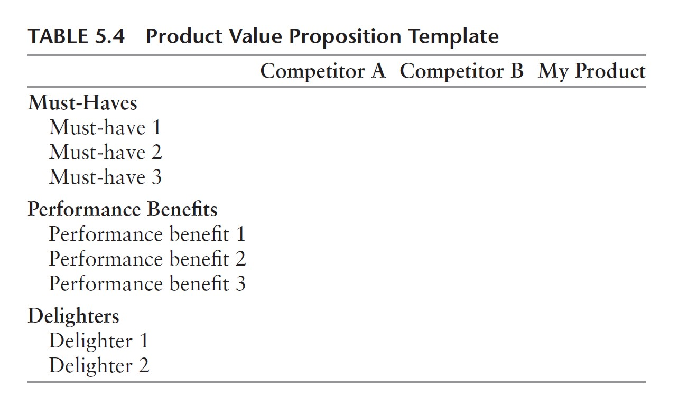
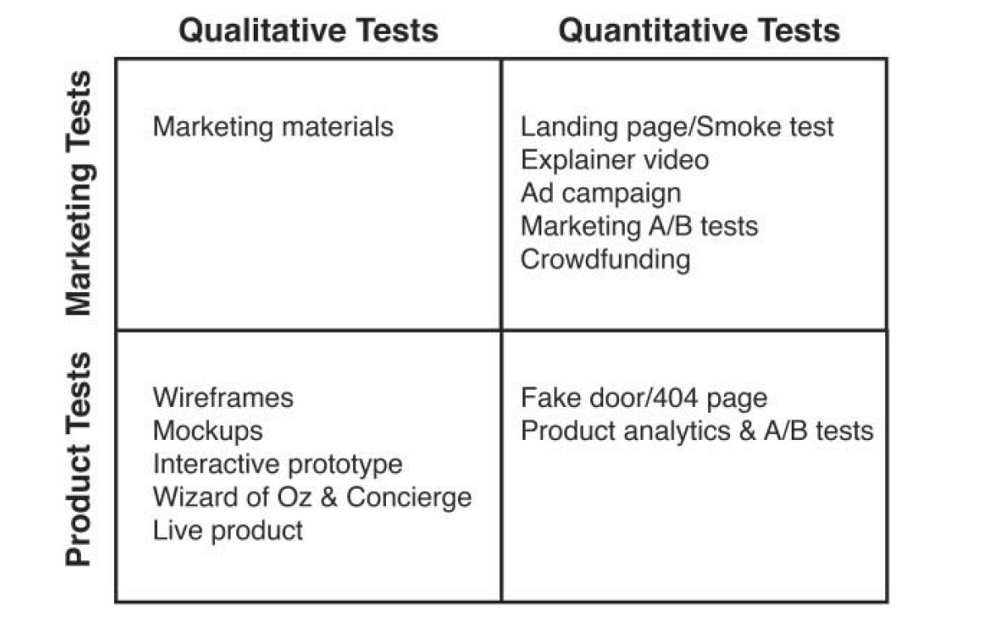

Now that you have a good understanding of the problem, the next step is to create a demo or prototype of your solution (i.e., a prototype of your product).

> Key question: Do I have a solution that creates significant customer value?

The above statement is also called ["Product-market fit"](https://pmarchive.com/guide_to_startups_part4.html). In the solution phase of the assignment, you are testing the following risks: 

* *Customer risk: Who has the pain? (Early Adopters)*

How do you identify early adopters?

* *Product risk: How will you solve these problems? (Solution)*

What is the minimum feature set needed to launch?

* *Market risk: What is the pricing model? (Revenue Streams)*

Will customers pay for a solution?
What price will they bear?


## Preparation
* [The Lean Product Playbook - Chapter 5: Define Your Value Propositiont](https://github.com/jmahieu/Lean-Project/raw/main/The%20Lean%20Product%20Playbook%20-%202015%20-%20Olsen.pdf)
* [The Lean Product Playbook - Chapter 6: Specify Your Minimum Viable Product (MVP) Feature Set](https://github.com/jmahieu/Lean-Project/raw/main/The%20Lean%20Product%20Playbook%20-%202015%20-%20Olsen.pdf)
* [The Lean Product Playbook - Chapter 7: Create Your MVP Prototype](https://github.com/jmahieu/Lean-Project/raw/main/The%20Lean%20Product%20Playbook%20-%202015%20-%20Olsen.pdf)
* [Running Lean - Chapter 8: The Solution Interview](https://github.com/jmahieu/Lean-Project/raw/main/Ash%20Maurya%20-%20Running%20Lean%20(2nd%20edition).pdf)

<br />

## A. Define Your Value Proposition
A good product is designed with focus on the set of needs that are important and that make sense to address together. A typical mistake made by first-time entrepreneurs is trying to add too many features to their products from the beginning. This is usually a waste of valuable resources and makes it also harder to test your value proposition hypothesis. A clear value proposition decreases the likelihood that you are just launching a “me too” product, focuses your resources on what’s most important, and increases your chances of success.

Relying on the information from your problem interviews of the previous step, you can define your value proposition. To define your value proposition use the template below (cf., Table 5.4 on page 73 of the [The Lean Product Playbook](https://github.com/jmahieu/Lean-Project/raw/main/The%20Lean%20Product%20Playbook%20-%202015%20-%20Olsen.pdf) ). See [Chapter 5](https://github.com/jmahieu/Lean-Project/raw/main/The%20Lean%20Product%20Playbook%20-%202015%20-%20Olsen.pdf) of the Lean Product Playbook on how to create your value proposition.

```{r, fig.cap="Value Proposition Template",fig.align='center',out.width="70%",echo=FALSE}

```

* **Must-Haves** are features that need to be incorporated into your product for customers to be satisfied with it. *Not* incorporating this feature would cause customer dissatisfaction, while incorporating them does not necessarily generate satisfaction (E.g., not incorporating seatbelts in a car would cause substantial dissatisfaction).

* With **performance benefits**, more is better. As the need is more fully met, the resulting customer satisfaction increases. For performance benefits, you should use whatever scale works best for you: A scale of “High,” “Medium,” and “Low” usually works well.

* **Delighters** provide unexpected benefits that exceed customer expectations, resulting in very high customer satisfaction. The absence of a delighter doesn’t cause any dissatisfaction because customers aren’t expecting it. Delighters are typically unique, so just list each delighter on a separate row and then mark “Yes” where applicable.

### **Deliverables** 

* Create a document in your workspace with the title "Value Proposition" with your filled in value proposition

<br />

## B. Specify Your Minimum Viable Product (MVP) Feature Set
Now that you have a clear understanding of your value proposition, the next step is to decide on the feature set for your [Minimum Viable Product (MVP)](http://www.startuplessonslearned.com/2009/08/minimum-viable-product-guide.html) candidate. You are not going to start off by designing a new product that delivers on your full value proposition, since that would take too long and be too risky. For your MVP, you want to identify the minimum functionality required to validate that you are heading in the right direction.

*Individually*, brainstorm about as many feature ideas as you can for how your product could deliver that benefit. You should be practicing divergent thinking, which means trying to generate as many ideas as possible without any judgment or evaluation. *User stories* (used in Agile development) are a great way to write your feature ideas to make sure that the corresponding customer benefit remains clear. See page 78 of [The Lean Product Playbook](https://github.com/jmahieu/Lean-Project/raw/main/The%20Lean%20Product%20Playbook%20-%202015%20-%20Olsen.pdf) ) on how to create user stories.

Next, as a *team* decide on which features you want to retain: you need to incorporate **at least 1** feature for each benefit/delighter of the value proposition. Match all the features to a particular benefit, and prioritize them. Now you need to make some tough decision on which features you want to keep. To start with, your MVP candidate needs to have all the must-haves you’ve identified. After that, you should focus on the main performance benefit you’re planning to use to beat the competition. You should select the set of feature chunks for this benefit that you believe will provide enough for customers to see the difference in your product. Delighters are part of your differentiation, too. You should include your top delighter in your MVP candidate. That may not be necessary if you have a very large advantage on a performance benefit. The goal is to make sure that your MVP candidate includes something that customers find superior to others products and, ideally, unique.

See Figure 6.3 on page 85 of [The Lean Product Playbook](https://github.com/jmahieu/Lean-Project/raw/main/The%20Lean%20Product%20Playbook%20-%202015%20-%20Olsen.pdf)  for an example on how to do this

### **Deliverables** 

* Update your "Value Proposition" document adding an extra column where you match the retained features to the corresponding benefits. In case you have more than one feature per benefit, add more columns keeping the most important feature in the most left column.

<br />

## C. Create your MVP Prototype

When you have decided on the features of your [Minimum Viable Product](http://www.startuplessonslearned.com/2009/08/minimum-viable-product-guide.html), it is time to actually start creating your first prototype! Remember, the goal is to test your hypothesis that your product will help solving your customer's problem. You do not want to build a finished and functional product at this point. You want to build just enough of the solution that you can put in front of customers for the purpose of measuring their reaction and further defining the requirements for your minimum viable product (MVP).

As you can see in the picture below, there are many ways to test this. For this assignment, we will use one type of qualitative test called a **"mockup"**. Mockups convey visual design details such as colors, fonts, and images. Some are intended to be “pixel perfect” while others may only represent the approximate size and position of design elements. Mockups are also sometimes referred to as “comps,” and are usually created with a graphic design application such as Illustrator, Photoshop, or Sketch. You may also want to check out [uizard](https://uizard.io/) if you are creating an app. Read pages 104-105 of the  [The Lean Product Playbook](https://github.com/jmahieu/Lean-Project/raw/main/The%20Lean%20Product%20Playbook%20-%202015%20-%20Olsen.pdf) to lean more about mockups. 


```{r, fig.cap="MVP Tests",fig.align='center',out.width="70%",echo=FALSE}

```

If you have little experience with developing product prototypes, you will benefit from reading [The Lean Product Playbook - Chapter 8: Apply the Principles of Great UX Design](https://github.com/jmahieu/Lean-Project/raw/main/The%20Lean%20Product%20Playbook%20-%202015%20-%20Olsen.pdf)

### **Deliverables** 

* Create a document titled "MVP Prototype" in which you show your MVP prototype/mockup

<br />

## D. Test Your Solution
When you have created your MVP prototype, it is time to test it with customers. Preferably, do this with the same people you interviewed before. You should have received permission to follow up from your earlier Problem interviews. If you can, also mix in some new people. Again, test your prototype with ***at least 5 customers***

You want to test the following three hypotheses:

1. Our solution actually solve customers' problem thereby creating significant value

1. Customers want to pay for our solution

1. Customers want to pay <amount> for our solution

Follow the [Solution Interview Script](https://github.com/jmahieu/Lean-Project/raw/main/%5BLean%20Series%5D%20Ash%20Maurya%20-%20Running%20Lean%20(2nd%20edition).pdf) on pages 103-107 of Running Lean. 

Regarding pricing, also take a look at pages 180-183.

### **Deliverables** 
* Create a document in your workspace with the title "Solution Interviews" where you document the findings of your interviews. **You need to do interviews with at least 5 customers (more is better)**. For each customer, use the template shown on page 107 of [Running Lean](https://github.com/jmahieu/Lean-Project/raw/main/Ash%20Maurya%20-%20Running%20Lean%20(2nd%20edition).pdf).

<br />

## E. Solution Interview Learnings
After you have conducted your initial interviews, sit together with your team and discuss the findings. The goal of this conversation is to determine whether you:

* Can identify the demographics of an early adopter

* Have a must-have problem

* Can define the minimum features needed to solve this problem

* Have a price the customer is willing to pay

* Can build a business around it (using a back-of-the-envelope calculation)

If this is the case: great! If this is not the case: **don't worry**. Many startups find out at this point that their solution does not fit. That is not bad news. In fact, it has saved you considerable time and resources because you didn't make a shiny finished product but just a simple mockup. 

## **Deliverables** 

* Create a document in your workspace with the title "Solution Interview Learnings" where you document what you have learned from the interviews. Use the template shown on pages 109-110 of [Running Lean](https://github.com/jmahieu/Lean-Project/raw/main/Ash%20Maurya%20-%20Running%20Lean%20(2nd%20edition).pdf) as an example. In particular, discuss whether you believe you are on the right track to achieve product-market fit or whether you need to drastically change your plan (and why)

## Further Readings and Background Material

* ["On product/market fit for startups (Marc Andreessen)](https://pmarchive.com/guide_to_startups_part4.html)


